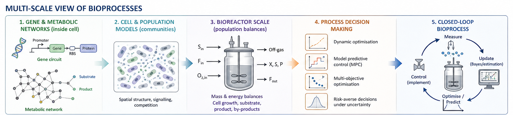

Bioprocesses span multiple scales — from gene regulatory networks and metabolic
pathways inside individual cells, to populations of interacting microorganisms, to
industrial bioreactors operating over hours and days. High-fidelity models at each
scale are often too complex to use directly for optimisation or control. My research
develops **reduced, computationally tractable models** that retain the essential
mechanistic structure of the underlying biology while being practical tools for
decision-making.

{width=100%}

## Gene & Metabolic Networks

At the smallest scale, I work with **metabolic reaction networks** and **gene circuit
models**. Genome-scale metabolic networks are far too large for dynamic optimisation —
I develop systematic reduction methods based on extreme pathway enumeration and
elementary flux modes to obtain compact networks that preserve the essential metabolic
capabilities of the organism. At the gene circuit level, I model how synthetic gene
circuits and optogenetic inputs interact with host cell metabolism, laying the
foundation for the μ4C project on cybergenetic control of bioprocesses.

## Cell & Population Models

At the cell and population scale, I work with **individual-based models (IbMs)** and
**cybernetic models** that capture how microbial communities behave as a collective.
IbMs simulate each cell individually, resolving spatial structure and social
interactions such as signalling and competition. Because IbMs are computationally
expensive, I develop biology-driven complexity reduction strategies — identifying
which interactions drive emergent community behaviour and which can be safely
neglected.

## Bioreactor Scale

At the reactor scale, I build **kinetic models** based on mass and energy balances
that describe how cell growth, substrate consumption, and product formation evolve
over time. These models are the workhorses of bioprocess optimisation — compact
enough to simulate in milliseconds, yet mechanistically grounded enough to
extrapolate beyond training conditions. I have applied these to beer fermentation,
algae cultivation, and small-scale biorefineries.

## Process Decision Making

Reduced models are only useful if they can support reliable decisions. I close the
loop by connecting bioprocess models to **dynamic optimisation**, **model predictive
control (MPC)**, and **multi-objective optimisation under uncertainty**. This includes
risk-averse strategies that account for parametric uncertainty when computing optimal
feeding trajectories or control actions — ensuring that decisions remain robust even
when the model is imperfect.

## Relevant Publications

::: {#refs}
:::