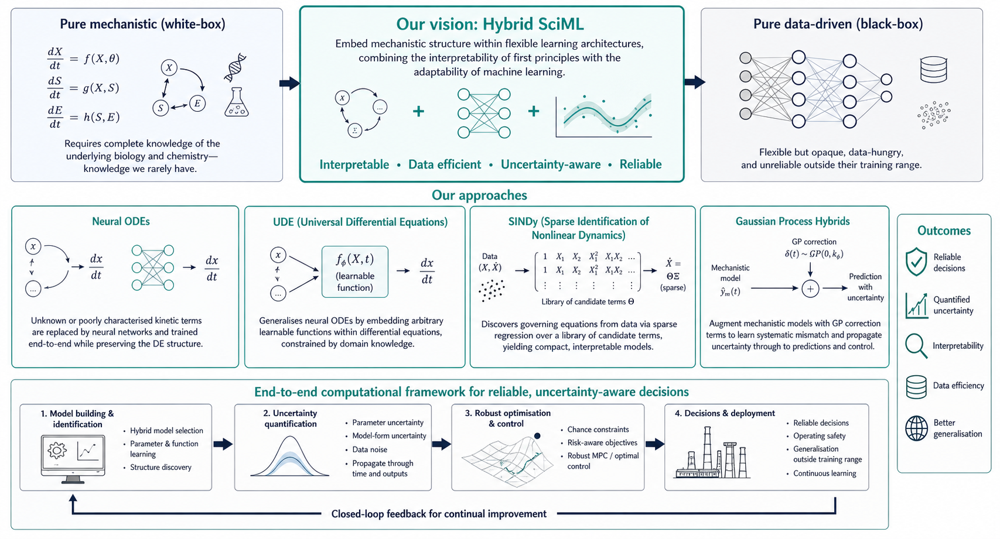

Pure mechanistic models require complete knowledge of the underlying biology and
chemistry. But we rarely have complete knowledge. Pure data-driven models are flexible but
opaque, data-hungry, and unreliable outside their training range. My research develops
a third path: **hybrid SciML frameworks** that embed mechanistic structure within
flexible learning architectures, combining the interpretability of first principles
with the adaptability of machine learning.

The long-term goal is a comprehensive, end-to-end computational framework for making
**reliable, uncertainty-aware decisions** using hybrid models: from model building
and identification, through uncertainty quantification, to robust optimisation and
control.

{width=100%}

## Approaches

**Neural ODEs**  
Unknown or poorly characterised kinetic terms in mechanistic ODE systems are replaced
by neural networks. The combined system is trained end-to-end, preserving the
differential equation structure while learning what first principles cannot specify.

**Universal Differential Equations (UDE)**  
A generalisation of neural ODEs where arbitrary learnable functions — not just neural
networks — are embedded within differential equations. This allows domain knowledge
to constrain the hypothesis space while data fills in the gaps.

**SINDy (Sparse Identification of Nonlinear Dynamics)**  
Rather than assuming a fixed model structure, SINDy discovers governing equations
directly from data by solving a sparse regression problem over a library of candidate
terms. The result is a compact, interpretable equation rather than a black-box network.
We have applied this to continuous direct compression processes with inherent delays,
combined with Bayesian inference for uncertainty quantification.

**Gaussian Process Hybrids**  
Mechanistic models are augmented with Gaussian process correction terms that learn
systematic model-plant mismatch from data. Because GPs are probabilistic, this
naturally propagates uncertainty through to predictions and control decisions.

## Relevant Publications

::: {#refs}
:::