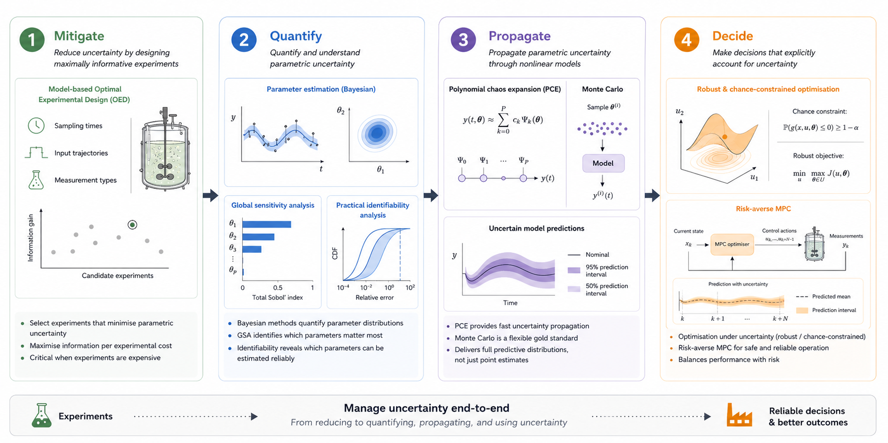

Pharmaceutical and bioprocess models are inherently uncertain: processes are often
stochastic, parameters are estimated from noisy data, and the models themselves are
approximations built on many assumptions. Ignoring this uncertainty leads to
overconfident predictions and unreliable decisions. My research addresses uncertainty
end-to-end — from reducing it experimentally, to quantifying and propagating it through
models, to making decisions that explicitly account for it.

{width=100%}

## Mitigate

Uncertainty can be reduced before it is a problem by designing experiments that are
maximally informative. I develop **model-based optimal experimental design (OED)**
methods that select sampling times, input trajectories, and measurement types to
minimise parametric uncertainty in the resulting model. This is especially important
in pharmaceutical and bioprocess applications where experiments are expensive.

## Quantify

Once a model is built, I quantify how uncertain its parameters are using **Bayesian
parameter estimation**, **global sensitivity analysis (GSA)**, and **practical
identifiability analysis**. GSA tells us which parameters matter most; identifiability
analysis tells us which can be estimated reliably from available data.

## Propagate

Parametric uncertainty must be propagated through nonlinear models to obtain uncertain
predictions. I use **polynomial chaos expansions (PCE)** and **Monte Carlo** methods,
benchmarking their efficiency and accuracy across different process models — from
population balance models for milling to kinetic models for fermentation.

## Decide

Ultimately, uncertainty must inform decisions. I develop **robust optimisation**,
**chance-constrained optimisation**, and **risk-averse model predictive control (MPC)**
strategies that account for model uncertainty when computing optimal operating
conditions or control actions.

---

## Relevant Publications

::: {#refs}
:::